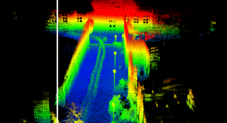

# Clean and Consistent MLS Point Clouds from the Start: Dynamic Removal Coupled with LIDAR-Inertial Odometry for Urban Scene

## 1.Introduction

This repository provides the implementation of our **dynamic-object-removal LiDAR–IMU odometry framework**, which improves pose estimation and mapping accuracy in dynamic urban environments.  
The system is model-driven, voxel-free, and supports seamless integration with state-of-the-art LIO frameworks.

  

> 🚀 The source code will be released once our paper is accepted. Please stay tuned!

---

### **1.1 Related paper**

Our related papers has been submitted to "xx  Journal".
The code will be published once the paper is accepted.

### **1.2 Related video**

Our accompanying videos are now available on **YouTube** (click below images to open) and [**Bilibili**](https://www.bilibili.com/video/123).

## 2. Prerequisites

### 2.1 **Ubuntu** and **ROS**

Ubuntu 20.04.

ROS Noetic. Follow [[ROS Installation](http://wiki.ros.org/ROS/Installation)]

### 2.2 **PCL** and **Eigen**

PCL      ≥ 1.8

`sudo apt install libpcl-dev`

Eigen    ≥ 3.3.4

`sudo apt install libeigen3-dev`

### 2.3 **livox_ros_driver**

Follow [livox_ros_driver Installation](https://github.com/Livox-SDK/livox_ros_driver).

### 2.4 TBB

Follow [[TBB Installation](https://solarianprogrammer.com/2019/05/09/cpp-17-stl-parallel-algorithms-gcc-intel-tbb-linux-macos/)] (**Note:** change the gcc-9.1/g++-9.1 to gcc-9/g++-9)

## 2. Build

## 3. Directly run

## 4. Rosbag Example
### 4.1 Simulated Dataset

  

Download our test bags here: [geogle](https://drive.google.com/drive/folders/1iaKaGEEDXGvJZKw0zyqs2RxRnA0hLK1N).

### 4.2 Real-world Dataset

   

Download our test bags here: [geogle](https://drive.google.com/drive/folders/1TYzT7nnJ6DlOu12cMFRslhtsvF8Fu-dj).

### 5. Example results 

### Acknowledgements 

### License 
The source code is released under [GPLv2](http://www.gnu.org/licenses/) license.

